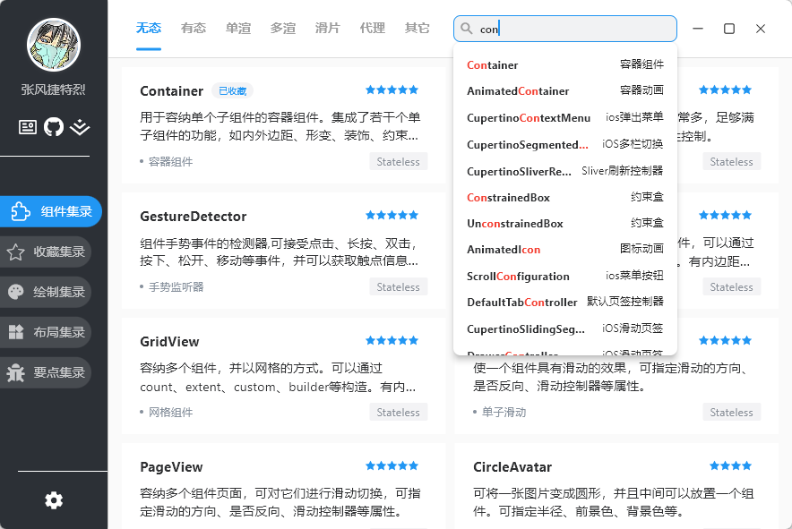

<h1 align="center" style="border-bottom: none">
    <b>
        <a href="https://github.com/toly1994328/FlutterUnit">FlutterUnit🔖</a><br>
    </b>
    ⭐️  All Platform Flutter Experience App  ⭐️ <br>
</h1>

<p align="center">
FlutterUnit is a cross-platform experience app, Here, you can fully explore the creativity that Flutter offers.
</p>

<p align="center">
<a href="https://github.com/AppFlowy-IO/appflowy"></a>
<a href="https://github.com/AppFlowy-IO/appflowy"></a>
<a href="https://opensource.org/licenses/GPL-3.0"></a>
</p>

<p align="center">
    <b> Download v3.0.0 : </b>
    <a href="https://github.com/toly1994328/FlutterUnit/releases/download/v3.0.0/FlutterUnit.apk"><b> [Android] </b></a> •
    <a href="https://apps.apple.com/cn/app/flutter-unit/id6450545123"><b>[iOS]</b></a> •
    <a href="https://github.com/toly1994328/FlutterUnit/releases/download/v3.0.0/FlutterUnitMac.zip"><b>[MacOS]</b></a> •
    <a href="https://github.com/toly1994328/FlutterUnit/releases/download/v3.0.0/FlutterUnitWin.zip"><b>[Windows]</b></a> •
    <a href="http://toly1994.com/flutter/"><b>[Web]</b></a>
</p>

<p align="center"></p>

---


### Env and Build 

#### Flutter Version

```
·]>>  flutter --version
Flutter 3.35.1 • channel stable • https://github.com/flutter/flutter.git
Framework • revision 20f8274939 (6 days ago) • 2025-08-14 10:53:09 -0700
Engine • hash 6cd51c08a88e7bbe848a762c20ad3ecb8b063c0e (revision 1e9a811bf8) (7 days ago) • 2025-08-13 23:35:25.000Z
Tools • Dart 3.9.0 • DevTools 2.48.0
```

#### Build Application

```
·]>>  git clone https://github.com/toly1994328/FlutterUnit.git
·]>>  cd FlutterUnit

Build Android:
·]>>  flutter build apk --target-platform --split-per-abi
Build iOS:
·]>>  flutter build ios
Build Windows:
·]>>  flutter build windows  
Build Linux:
·]>>  flutter build linux
Build web:
·]>>  flutter build web
```


#### My Flutter Books 
- 🔥 [免费] [掘金小册 -《Flutter 入门教程》](https://juejin.cn/book/7212822723330834487)
- 🔥  [掘金小册 -《Flutter 语言基础 - 梦始之地》](https://juejin.cn/book/6844733827617652750)
- 🔥  [掘金小册 -《Flutter 绘制指南 - 妙笔生花》](https://juejin.im/book/6844733827265331214)
- 🔥  [掘金小册 -《Flutter 手势探索 - 执掌天下》](https://juejin.cn/book/6896378716427911181)
- 🔥  [掘金小册 -《Flutter 动画探索 - 流光幻影》](https://juejin.cn/book/6965102582473687071)
- 🔥  [掘金小册 -《Flutter 滑动探索 - 珠联璧合》](https://juejin.cn/book/6984685333312962573)
- 🔥  [掘金小册 -《Flutter 布局探索 - 薪火相传》](https://juejin.cn/book/7075958265250578469)
- 🔥  [掘金小册 -《Flutter 渲染机制 - 聚沙成塔》](https://juejin.cn/book/6965102582473687071)

---

- [Flutter环境配置](https://github.com/toly1994328/FlutterUnit/issues/22)
- [Flutter实用插件集录 ](https://github.com/toly1994328/FlutterUnit/issues/41)
- [Flutter要点集录 ](https://github.com/toly1994328/FlutterUnit/labels/point)


---


#### MacOS 桌面版本组件界面


#### Windows 桌面版本组件界面




> 开源不易，请我喝咖啡 ~


#### Star History

[](https://star-history.com/#toly1994328/FlutterUnit&Date)

### 一、组件的展示页面

#### 1. `300+组件收录`

> Flutter源码中的可用的组件一共350个左右，纷繁复杂，也没有明确的分类标准
FlutterUnit 对`大大小小，常用不常用`的组件能收的尽量收录。并`根据个人感觉进行评星 `
`目前收录组件306个`，每个都有至少一个演示展现和代码展示。

| . | . | . |
|------|------------|------------|
| |   |           |

---

#### 2. 组件详情页

> `213个组件`全部都有详情页。对于重要的组件会详细展现
一般都会有某个演示对应的组件和属性,尽量做到细致，如果有需要补充，欢迎联系我。
`最重要的是: 所有的演示展现都是Flutter的组件形成的，而非图片，这就意味着可操作性更高。`

| . | . | . |
|------|------------|------------|
| | |     |
|    |        ||

---

#### 3. 组件的可操作性

> 对一些操作交互的组件或有可操作性的某些组件，`提供操作演示`

| . | . | . |
|------|------------|------------|
| | |   |
|   |       ||

---

#### 4. 相关组件的关联切换
> `相关组件通过link to 可以进行切换, 满足你的探索欲。`
如果有的关联未加入，欢迎联系我，对我来说，加个数字就行了。

| . | . | . |
|------|------------|------------|
|||   |


---

#### 5. 代码的查看和分享
> 激动人心的是，你可以通过右侧的图标`展开/隐藏 实现下面效果的代码`
并且`支持分享`，如果你想亲自体验，so，easy ! 而且`代码高亮样式可以自定义`。


| . | . | . |
|------|------------|------------|
| | |   |

---


### 二、全局配置

#### 1. 颜色主题
> 只提供八种颜色，可在`右滑菜单页`的`我的主题`配置,`可以拓展`

| . | . | . |
|------|------------|------------|
| |  |     |

---


#### 2.字体配置

> 支持全局字体设置,`可以拓展`

| . | . | . |
|------|------------|------------|
| |  |   |
---


#### 3.item样式设置

> 支持item样式设置，`可以拓展，支持征集`，详见`Flutter Unit 1.0 征集方案`

| . | . | . |
|------|------------|------------|
|| | | 
---

#### 4.代码面板风格设置

> 支持代码风格设置，`可以拓展，支持征集`，详见`Flutter Unit 1.0 征集方案`

| . | . |
|------|------------|
|| |
|| 

---


### 三、搜索与收藏功能


#### 1.搜索功能

> 由于Flutter中Widget比较杂乱，不太好分类，所以搜索是非常重要的
另外可以根据星级进行过滤，支持多选。目前正在考虑根据功能分类，之后会有所完善。


| . | . | . |
|------|------------|------------|
| | |     |

---

#### 2.收藏功能

| 添加收藏集 | 修改收藏集 | 删除收藏集 |
|------|------------|------------|
|   |     |        | 

| 长按右菜单滑页 | 长按左菜单滑页 | 详情内长按展示收藏菜单 |
|------|------------|------------|
|  |        |        |

| 删除与数据同步 | 组件加入收藏集 | 收藏集支持多选 |
|------|------------|------------|
|   |         |    |

> `FlutterUnit 2.0 `目前基本就是这么多功能，可以在Github中下载打包后的apk玩玩
希望能对你的Flutter学习有所帮助。

---
