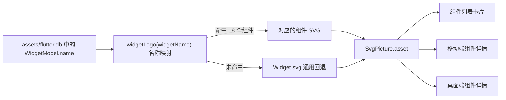

# Widget Logo SVG 支持现状分析

> 基线：2026-08-09 当前工作区源码与 `assets/flutter.db`。本文只统计组件卡片及组件详情页使用的 Widget Logo，不统计 Markdown 图片等其他 SVG 使用场景。

## 1. 结论摘要

当前 Widget Logo 已具备完整的运行链路，但仍处于小规模试点阶段：

- `assets/images/widgets/` 中共有 **21** 个 `.svg` 文件。
- 其中 **20** 个文件非空，**1** 个文件为空。
- 源码显式映射了 **18** 个组件，映射文件均存在且非空。
- `Widget.svg` 是所有未匹配组件的通用回退图。
- `Autocomplete.svg` 内容有效，但没有加入组件名映射，运行时仍显示 `Widget.svg`。
- `Image.svg` 是 0 字节文件，也没有加入映射。
- 以数据库全部 **553** 个组件为口径，定制 Logo 覆盖率为 **3.25%**。
- 以具有演示节点的 **349** 个组件为口径，覆盖率为 **5.16%**。
- 以进入系统分类的 **206** 个组件为口径，覆盖率为 **8.74%**。

因此，现阶段的首要问题不是 SVG 渲染能力，而是资产生产、映射接入、完整性校验和覆盖进度管理尚未形成统一机制。

## 2. 当前运行链路

关键入口：

| 职责 | 源码位置 | 当前行为 |
|---|---|---|
| 主映射与列表 Logo | `modules/widget_system/widget_ui/lib/src/view/widget_tiled/widget_logo.dart` | 按组件英文名选择 SVG，未命中时返回 `Widget.svg`；列表宽度为 80 |
| 详情 Logo | `modules/widget_system/widget_ui/lib/src/view/widget_tiled/widget_detail_logo.dart` | 复用同一映射；桌面端宽度为 120，非桌面复用列表 Logo |
| 列表入口 | `modules/widget_system/widget_ui/lib/src/view/widget_tiled/widget_item.dart` | `WidgetModel.name` 传入 `WidgetLogo` |
| 移动端详情入口 | `modules/widget_system/widget_module/lib/views/mobile/widget_detail/widget_detail_panel.dart` | 使用 `WidgetDetailLogo` |
| 桌面端详情入口 | `modules/widget_system/widget_module/lib/views/desk_ui/widget_detail/widget_detail_panel.dart` | 使用 `WidgetDetailLogo` |
| 资源声明 | `pubspec.yaml` | 整体声明 `assets/images/widgets/` |

SVG 由 `flutter_svg` 的 `SvgPicture.asset` 渲染。所有有效文件均使用 `128 × 128` 画布和 `viewBox="0 0 128 128"`，基础尺寸规范已经统一。当前渲染未设置 `colorFilter`，Logo 使用 SVG 文件自身的填充、描边和渐变颜色。

## 3. 已接入的 18 个定制 Logo

| 组件 | SVG 文件 | 数据库 ID | 演示节点数 |
|---|---|---:|---:|
| Container | `Container.svg` | 1 | 6 |
| Text | `Text.svg` | 2 | 6 |
| Card | `Card.svg` | 3 | 2 |
| FlutterLogo | `FlutterLogo.svg` | 4 | 2 |
| Banner | `Banner.svg` | 5 | 1 |
| Icon | `Icon.svg` | 6 | 2 |
| CircleAvatar | `CircleAvatar.svg` | 9 | 1 |
| Chip | `Chip.svg` | 11 | 3 |
| InputChip | `InputChip.svg` | 14 | 2 |
| FilterChip | `FilterChip.svg` | 15 | 1 |
| MaterialButton | `MaterialButton.svg` | 23 | 3 |
| FloatingActionButton | `FloatingActionButton.svg` | 28 | 3 |
| RichText | `RichText.svg` | 101 | 2 |
| GestureDetector | `GestureDetector.svg` | 146 | 3 |
| ListView | `ListView.svg` | 162 | 4 |
| GridView | `GridView.svg` | 163 | 4 |
| SingleChildScrollView | `SingleChildScrollView.svg` | 164 | 2 |
| PageView | `PageView.svg` | 165 | 3 |

这 18 个组件在数据库中都存在，且都至少有一个演示节点。映射引用的 18 个 SVG 文件也全部存在且非空。

## 4. 已有资产但尚未形成有效支持

| 文件 | 数据库组件 | 当前状态 | 直接影响 | 建议 |
|---|---|---|---|---|
| `Autocomplete.svg` | Autocomplete，ID 356，2 个演示节点 | SVG 有效，未进入 `widgetLogo` 映射 | 页面仍显示通用 `Widget.svg` | 加入映射即可形成第 19 个有效支持 |
| `Image.svg` | Image，ID 38，6 个演示节点 | 文件为 0 字节，未进入映射 | 无法渲染为定制 Logo；当前由通用图兜底 | 先补齐有效 SVG，再加入映射 |

`Image` 是 5 星组件，并列当前演示节点数最多的组件之一，因此应当视为最高优先级缺口，而不是普通的未覆盖项。

## 5. 覆盖率口径

| 统计口径 | 组件总数 | 已覆盖 | 未覆盖 | 覆盖率 |
|---|---:|---:|---:|---:|
| 数据库全部组件 | 553 | 18 | 535 | 3.25% |
| 具有演示节点的组件 | 349 | 18 | 331 | 5.16% |
| 进入系统分类的组件 | 206 | 18 | 188 | 8.74% |

建议后续同时维护三种口径，但将“具有演示节点的组件”作为主要生产进度口径。数据库全量中可能包含暂时没有展示价值的类型；系统分类口径又不能覆盖搜索可达但未分类的组件。演示节点口径更接近用户实际能够深入体验的组件集合。

## 6. 当前设计与工程风险

### 6.1 仅增加文件不会自动生效

Logo 不是按 `${widgetName}.svg` 自动发现，而是由 `widgetLogo` 的 `switch` 手工映射。像 `Autocomplete.svg` 这样的有效资产会因为漏加映射而长期不可见。

### 6.2 空文件不会在提交阶段被阻止

当前没有发现针对 SVG 的自动化测试或资产检查。`Image.svg` 已经进入资源目录，但 0 字节文件仍能留在仓库中。后续批量生产 Logo 时，这类问题会随数量快速放大。

### 6.3 存在一份重复且当前无有效调用的旧映射

`modules/widget_system/widget_module/lib/views/components/widget_logo_map.dart` 复制了同一套 18 项映射。桌面详情文件仍导入它，但实际使用的是 `widget_ui` 导出的 `WidgetDetailLogo`，旧文件中的 `WidgetLogo` 没有调用点。

继续同时维护两份映射容易出现新增 Logo 只改一处的分叉，应收敛到 `widget_ui` 的唯一实现。

### 6.4 回退机制掩盖接入遗漏

`Widget.svg` 保证应用不会因为缺少定制 Logo 而失败，这是合理的运行时策略；但它同时让“文件缺失”“映射缺失”和“尚未设计”在界面上表现完全一致，不利于开发阶段发现问题。

### 6.5 资产规范只有画布一致，尚无语义规范

现有有效 SVG 都统一为 `128 × 128`，但代码和文档尚未规定：

- 安全边距和主体占比；
- 背景透明规则；
- 浅色、深色和主题色背景下的最小对比度；
- 渐变、描边、阴影和颜色数量限制；
- 是否允许文字、滤镜、蒙版、外链资源或嵌入位图；
- 同族组件如何保持家族特征并体现差异；
- Logo 的设计来源、版本和审核状态如何记录。

如果目标是为数百个组件建立长期可维护的视觉语言，这些规则应先于大规模生产确定。

## 7. 建议实施顺序

### P0：修复现有资产闭环

1. 将有效的 `Autocomplete.svg` 接入映射。
2. 重新设计并补齐 `Image.svg`，确认非空后接入映射。
3. 删除或收敛旧的重复映射，只保留一个 Logo 解析入口。
4. 增加校验：映射文件必须存在、非空、可解析，组件名必须存在于数据库。

### P1：建立设计规范和进度清单

1. 固定 `128 × 128`、透明背景、安全区和视觉重量规范。
2. 以数据库组件 ID 作为稳定身份，以组件名作为可读文件名。
3. 建立状态：`todo`、`draft`、`reviewed`、`integrated`。
4. 优先覆盖 5 星组件、演示节点多的组件和首页高频组件。

首批建议关注：`Image`、`Flex`、`Wrap`、`DecoratedBox`、`Transform`、`TextField`、`Padding`、`Align`、`Stack`、`Material`、`ListTile`、`LayoutBuilder`。

### P2：让资产自动发现

当文件命名严格等于组件英文名时，可将解析规则收敛为“优先读取同名 SVG，不存在则使用 `Widget.svg`”，避免每新增一个 Logo 都修改 Dart `switch`。开发或 CI 阶段再输出未覆盖清单，运行时继续安全回退。

### P3：形成可视化验收

建议提供 Logo 总览页或自动生成预览图，至少同时检查：

- 80 像素列表尺寸；
- 120 像素桌面详情尺寸；
- 多种主题背景色；
- 浅色与深色模式；
- 同族 Logo 并排时的识别度和一致性。

## 8. 建议的完成标准

单个组件的 SVG Logo 只有同时满足以下条件，才应计为“已支持”：

1. 数据库中存在对应组件名和 ID。
2. SVG 文件存在、非空且 XML 可解析。
3. 使用 `128 × 128` 画布和统一 `viewBox`。
4. 组件名能够解析到该 SVG，而不是落入 `Widget.svg`。
5. 列表、移动端详情和桌面端详情均可正常渲染。
6. 在目标背景和尺寸下通过视觉审核。
7. 自动化校验能够防止文件缺失、空文件和映射遗漏回归。

## 9. 维护入口

- SVG 资产：`assets/images/widgets/`
- 当前唯一有效映射：`modules/widget_system/widget_ui/lib/src/view/widget_tiled/widget_logo.dart`
- 详情渲染：`modules/widget_system/widget_ui/lib/src/view/widget_tiled/widget_detail_logo.dart`
- 组件数据基线：`assets/flutter.db`
- 重复旧实现：`modules/widget_system/widget_module/lib/views/components/widget_logo_map.dart`

每次新增一批 Logo 后，应重新统计文件总数、有效文件数、映射覆盖数以及三种覆盖率，并对新增文件执行 XML、画布、映射和小尺寸视觉校验。
