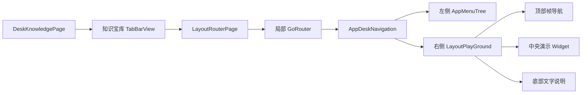
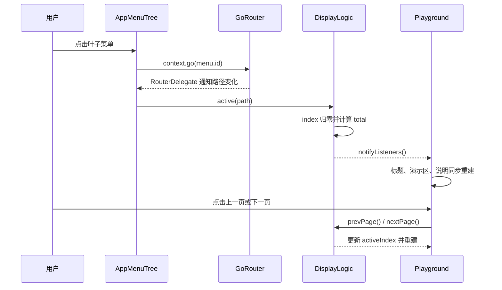

# FlutterUnit 布局宝库实现说明

本文说明 FlutterUnit 桌面端“知识宝库 → 布局宝库”的实现逻辑，作为新增布局案例、调整导航和排查页面不同步问题时的代码导航。分析基线为提交 `11b0452c`。

后续案例建设顺序和完成标准见：[布局宝库建设计划](ROADMAP.md)。

## 1. 功能定位

布局宝库不是从数据库动态读取内容的文章系统，而是一个完全由 Dart 源码配置的交互式布局教学模块。每个主题由若干个 `DisplayFrame` 组成；用户从左侧菜单选择主题后，可在顶部切换该主题下的演示帧，在中央操作真实 Flutter Widget，并在底部阅读说明。

当前桌面端有效收录：

| 分类 | 有效路径 | 演示帧数 | 主要内容 |
|---|---:|---:|---|
| 布局总览 | 1 | 1 | 分类导航与内容概览 |
| 基本布局 | 5 | 14 | 约束、尺寸、边距、对齐、定位 |
| 多子布局 | 4 | 10 | Flex 空间分配、Wrap、Stack 及交互式 Playground |
| 滑动布局 | 3 | 3 | ListView、GridView、PageView |
| 菜单浮层 | 3 | 3 | DropdownButton、DropdownMenu、Autocomplete |
| 合计 | 16 | 31 | — |

`LayoutPage` 当前复用 `LayoutRouterPage`，桌面端功能链路完整；窄屏下仍使用侧边菜单，尚未提供专门的移动端导航形态。

## 2. 页面入口与整体结构

外层入口位于 `artifact` 包的 `DeskKnowledgePage`。知识宝库使用三页 `TabBarView`，第一页直接嵌入布局包导出的 `LayoutRouterPage`。



首查入口：

| 职责 | 源码入口 |
|---|---|
| 知识宝库外层页签 | `../artifact/lib/src/articles/view/desk_artifact_page.dart` |
| 布局包公开入口 | `lib/layout.dart` |
| 局部路由与状态初始化 | `lib/src/views/layout_page.dart` |
| 桌面 Shell 路由 | `lib/src/navigation/router/desk_router.dart` |
| 左右分栏骨架 | `lib/src/navigation/view/app_desk_navigation.dart` |
| Playground 三段式布局 | `lib/src/views/display/layout_playground.dart` |

`LayoutRouterPage` 内部创建一套局部 `GoRouter`，初始地址是 `/home`。这套路由只服务布局宝库，不会把左侧主题切换暴露为 FlutterUnit 的顶层路由。

## 3. 三套配置如何关联

实现的核心是“同一个完整路径”同时串起菜单、路由和内容映射。

### 3.1 菜单树

`menu_repository_impl.dart` 聚合 `base_layout.dart`、`multi.dart`、`scroll.dart` 和 `funny.dart`。父子路径由 `TolyRailMenuTree` 的 `MenuNode.fromMap` 组合，例如：

- 父节点 `/base` + 子节点 `/size` → `/base/size`
- 父节点 `/multi` + 子节点 `/flex` → `/multi/flex`

### 3.2 路由匹配

`desk_router.dart` 使用相同的一级分类声明参数路由：

```text
base/:name
multi/:name
scroll/:name
funny/:name
```

这些路由最终都构建同一个 `FrameDisplayPanel`。因此新增同类主题通常不需要为每个子主题新增页面路由，只需确保分类参数路由已经存在。

### 3.3 内容映射

`data/display_map/display_map.dart` 中的 `kDisplayMap` 以完整路径为键，以 `List<DisplayFrame>` 为值。每个 `DisplayFrame` 包含：

| 字段 | 作用 | 当前消费位置 |
|---|---|---|
| `title` | 当前演示标题 | `PlaygroundTopBar` |
| `desc` | 教学说明 | `PlaygroundBottomBar` |
| `display` | 实际演示 Widget 构造器 | `FrameDisplayPanel` |
| `src` | 仓库内源码路径 | `PlaygroundTopBar` 源码按钮 |

三套配置必须保持路径一致。仅添加菜单会导致内容映射查找失败；仅添加映射则用户无法从菜单进入。

## 4. 状态与交互流程

布局宝库没有使用外层知识页面的 Bloc。它在 `LayoutRouterPage` 中创建 `DisplayLogic`，再通过 `DisplayScope`（`InheritedNotifier<DisplayLogic>`）向菜单、顶栏、内容和底栏共享状态。

`DisplayState` 只维护三个值：

- `router`：当前主题完整路径；
- `activeIndex`：当前主题中的演示帧下标；
- `total`：当前主题的演示帧数量。

当前帧并不存入状态，而是通过 `kDisplayMap[router]![activeIndex]` 动态取得。



路由监听由 `RouterChangeListenerMixin` 完成。它监听局部 `GoRouterDelegate`，在地址变化后同步菜单选中状态，并调用 `DisplayLogic.active(path)`。这使浏览器式路由变化、菜单高亮和当前演示内容保持一致。

## 5. Playground 的渲染职责

右侧 `LayoutPlayGround` 是固定的三段结构：

1. `PlaygroundTopBar`：显示 `当前序号/总数`、帧标题以及上一页、下一页、源码按钮；
2. `FrameDisplayPanel`：调用当前 `DisplayFrame.display(context)` 构建真实演示；
3. `PlaygroundBottomBar`：展示当前帧的 `desc`。

上一页和下一页由 `DisplayLogic.enablePrev`、`enableNext` 做边界判断，抵达首尾后点击不会越界。目前按钮视觉上没有根据可用状态禁用，仅由逻辑层忽略无效操作。

复杂主题会把独立的交互状态封装在演示 Widget 内。例如 Flex、Wrap、Stack 各自拥有 Playground 和操作面板；全局 `DisplayLogic` 只负责选择哪一帧，不管理演示内部属性。这个边界让新增案例不会不断膨胀全局状态。

## 6. 新增一个布局主题

以新增 `/base/ratio` 为例，最小改动链路如下：

1. 在 `lib/src/views/` 下创建演示 Widget；
2. 在 `data/display_map/base.dart` 中创建一个或多个 `DisplayFrame`；
3. 在 `data/display_map/display_map.dart` 注册 `'/base/ratio': baseRatio`；
4. 在 `navigation/menu/base_layout.dart` 增加子菜单 `'/ratio'`；
5. 复用现有 `base/:name` 路由，无需新增 `GoRoute`；
6. 验证菜单选中、首帧显示、前后切换和主题切换后下标归零。

如果新增的是全新一级分类，还需要：

1. 新增分类菜单文件并接入 `layoutMenus`；
2. 在 `desk_router.dart` 增加对应的 `category/:name` 路由；
3. 为该分类的每个叶子路径注册 `kDisplayMap`。

路径建议集中定义或至少在提交前逐项比对，因为当前实现大量使用字符串，并通过 `!` 假定映射一定存在。

## 7. 当前边界与维护风险

### 7.1 已确认的功能边界

- 顶部源码按钮会打开 GitHub 上的案例文件；该能力依赖系统浏览器和网络环境，打开失败时会复制仓库内路径。
- `LayoutPage` 已可复用完整布局宝库，但窄屏仍沿用桌面侧栏，移动端自适应导航尚未单独设计。
- Popable 当前包含三种基础交互案例，尚未覆盖 MenuAnchor、PopupMenuButton 等更多浮层组件。

### 7.2 结构性风险

- 菜单、路由、内容映射分别维护，字符串拼写错误仍可能在运行时暴露；当前测试会检查所有叶子菜单均有内容映射，运行时也会安全忽略未知路径。
- Playground 与部分演示大量硬编码白色，深色主题支持不完整。
- 源码地址目前固定指向 GitHub `master` 分支；分支重命名或目录迁移时需同步修改基础地址与 `DisplayFrame.src`。

## 8. 排障索引

| 现象 | 首先确认 | 继续查看 |
|---|---|---|
| 点击菜单后崩溃 | 菜单完整路径是否存在于 `kDisplayMap` | `DisplayLogic.active` 的空值断言 |
| 菜单高亮变化但内容不变 | 路由监听是否触发 `onChangeRoute` | `RouterChangeListenerMixin`、`DisplayScope` |
| 内容切换但标题或说明不变 | 三处是否都读取同一个 `DisplayScope` | top bar、panel、bottom bar |
| 新分类无法进入 | 是否声明了对应 `category/:name` | `desk_router.dart` |
| 上一页/下一页无响应 | 当前是否已经位于首帧或尾帧 | `enablePrev`、`enableNext`、映射列表长度 |
| 深色模式出现白块 | 是否存在硬编码 `Colors.white` | `AppDeskNavigation`、`LayoutPlayGround` 和具体案例 |
| 源码按钮无响应 | 系统是否允许唤起外部浏览器 | 剪贴板中回退复制的 `DisplayFrame.src` |

## 9. 建议的最小验证集合

新增或调整案例后至少验证：

- 从知识宝库进入布局宝库，默认打开 `/home`；
- 每个新增叶子菜单可进入且不会出现空值断言；
- 切换主题后 `activeIndex` 回到 0，`total` 与帧数一致；
- 上一页、下一页在首尾边界不越界；
- 标题、中央案例和底部说明始终属于同一帧；
- 交互式 Playground 修改属性时不影响主题级导航状态；
- Windows 桌面窗口缩放后，左侧菜单与右侧内容无溢出；
- 若修改主题颜色，分别检查亮色和暗色模式。

`test/layout_test.dart` 已覆盖叶子菜单映射、帧元信息、主题切换和未知路径保护。界面响应式、外部浏览器唤起与各 Playground 的具体交互仍需人工运行验证。
